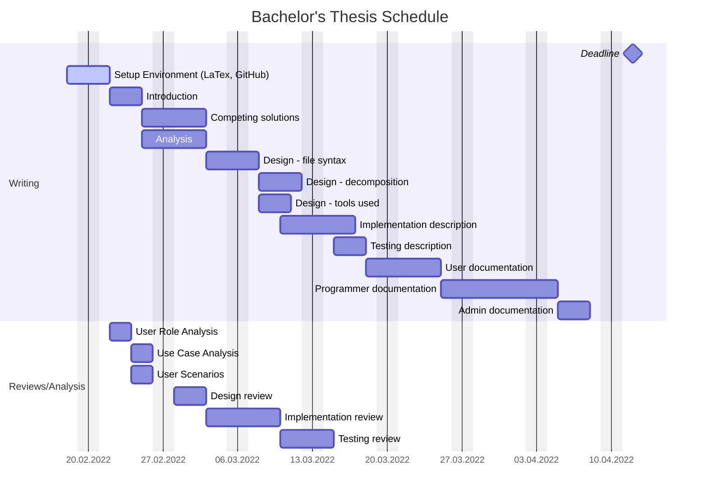

# Schedule

```mermaid
gantt
    title Bachelor's Thesis Schedule
    dateFormat DD.MM.YYYY
    axisFormat %d.%m.%Y
    excludes weekdays saturday,sunday

    section Writing
    Deadline: milestone, 12.04.2022, 0d

    Setup Environment (LaTex, GitHub): active, environment, 18.02.2022, 2d
    Introduction: introduction, after environment, 3d
    Competing solutions: 4d
    Analysis: after introduction, 4d
    Design - file syntax: syntax, after design_review, 3d
    Design - decomposition: after syntax, 4d
    Design - tools used: after syntax, 3d
    Implementation description: after implementation_review, 5d
    Testing description: after tests_review, 3d
    User documentation: 5d
    Programmer documentation:7d
    Admin documentation: 3d
    section Reviews/Analysis
    User Role Analysis: analysis_roles, after environment, 2d
    Use Case Analysis: after analysis_roles, 2d
    User Scenarios: analysis_scenarios, after analysis_roles, 2d
    Design review: design_review, after analysis_scenarios, 3d
    Implementation review: implementation_review, after design_review, 5d
    Testing review: tests_review, after implementation_review, 3d 
```