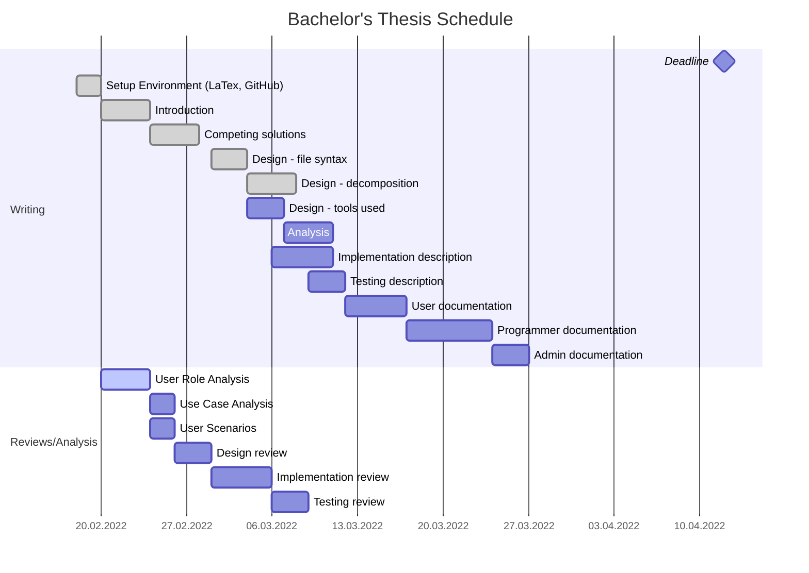

# Schedule and achievements
This part of the project documentation consists of a **schedule** and a **list of project-related achievements** with links to them.

## Achievements
- ✅ Environment setup
    - ✅ [GitHub repository](./README.md)
    - ✅ [Schedule](.)
    - ✅ [Latex project initialized](./thesis)
    - ✅ [Github Actions for compiling Latex](./actions/workflows/build_latex.yml)

- Introduction
    - ✅ [Basics, reasons for the work](./thesis/chapters/introduction.tex)
    - Competition analysis

- Analysis
    ... ?