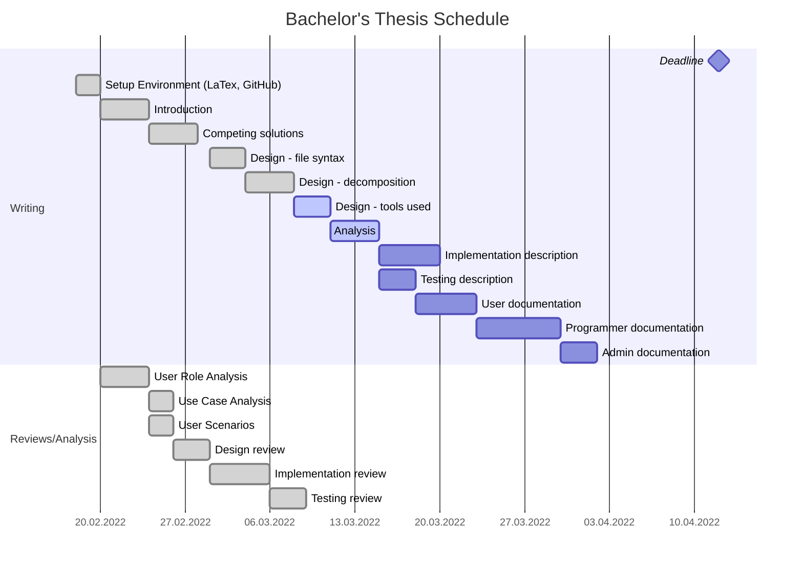

# Schedule and achievements
This part of the project documentation consists of a **schedule** and a **list of project-related achievements** with links to them.

```mermaid
gantt
    title Bachelor's Thesis Schedule
    dateFormat DD.MM.YYYY
    axisFormat %d.%m.%Y

    section Writing
    Deadline: milestone, 12.04.2022, 0d

    Setup Environment (LaTex, GitHub): done, environment, 18.02.2022, 2d
    Introduction: done, introduction, after environment, 4d
    Competing solutions: done, 4d
    Design - file syntax: done, syntax, after design_review, 3d
    Design - decomposition: done, decomp, after syntax, 4d
    Design - tools used: active, tools, after decomp, 3d
    Analysis: active, analysis, after tools, 4d
    Implementation description: after analysis, 5d
    Testing description: after analysis, 3d
    User documentation: 5d
    Programmer documentation:7d
    Admin documentation: 3d

    section Reviews/Analysis

    User Role Analysis: done, analysis_roles, after environment, 4d
    Use Case Analysis: done, after analysis_roles, 2d
    User Scenarios: done, analysis_scenarios, after analysis_roles, 2d
    Design review: done, design_review, after analysis_scenarios, 3d
    Implementation review: done, implementation_review, after design_review, 5d
    Testing review: done, tests_review, after implementation_review, 3d 
```

## Achievements
- ‚úÖ Environment setup
    - ‚úÖ [GitHub repository](./README.md)
    - ‚úÖ [Schedule](.)
    - ‚úÖ [Latex project initialized](./thesis)
    - ‚úÖ [Github Actions for compiling Latex](./actions/workflows/build_latex.yml)

- Introduction
    - ‚úÖ [Basics, reasons for the work](./thesis/chapters/introduction.tex)

- Analysis
    - ‚úÖ [Competition analysis](./thesis/chapters/analysis/related.tex)
    - ‚úÖ [Functional requirements](./thesis/chapters/requirements.tex)
    - üü® [Use Case analysis](./thesis/chapters/usecase_analysis.tex)
        - ⏭️ User Scenarios

- Design
    - ‚úÖ [Format design](./thesis/chapters/design/formatDesign.tex)
    - üü® [Interpreter design](./thesis/chapters/interpretDesign.tex)
    - ⏭️ Editor design